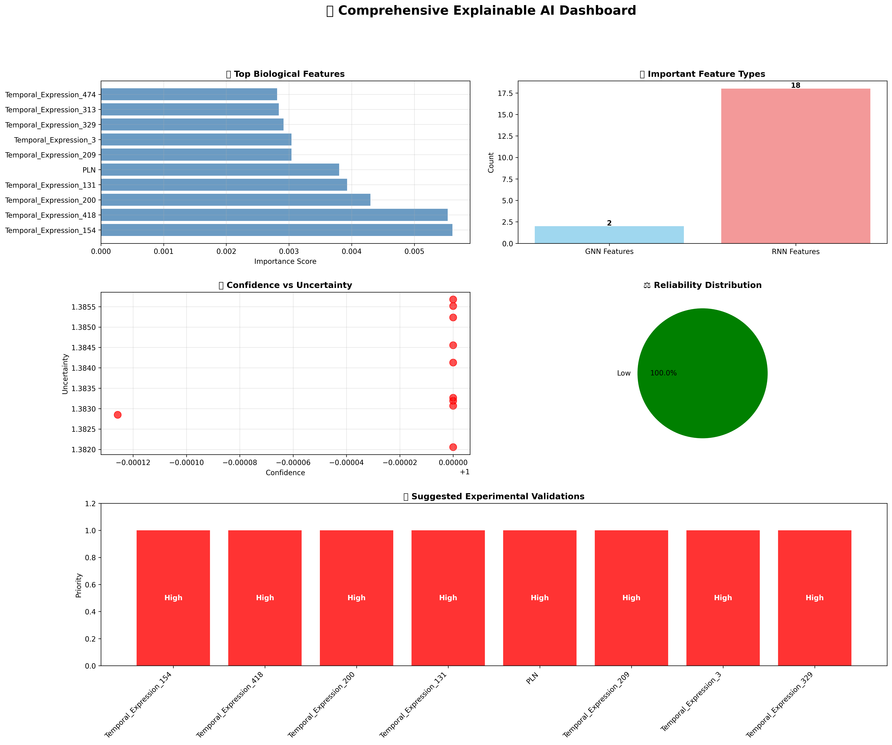
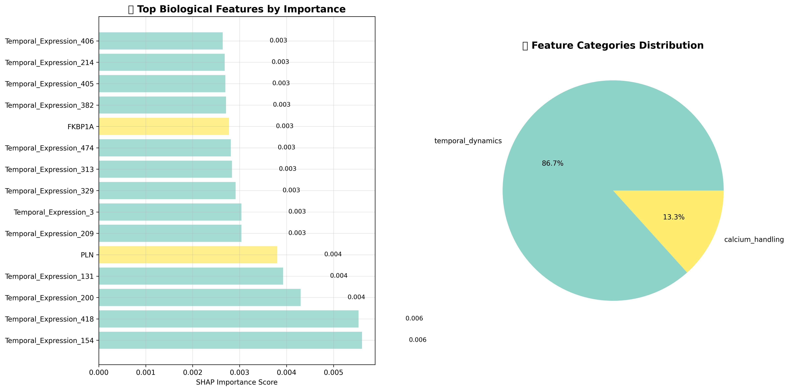
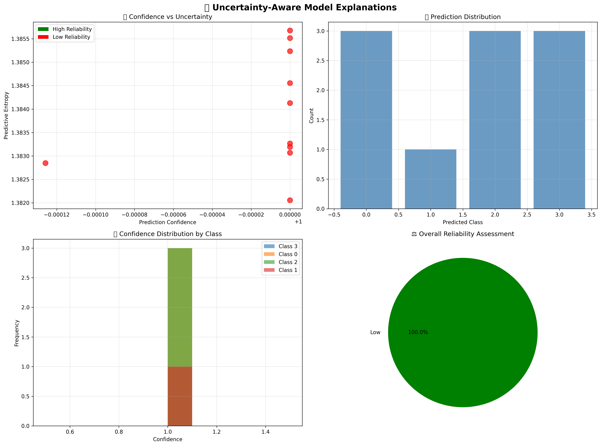

# Hybrid GNN-RNN Model for Cardiomyocyte Differentiation Prediction

[](https://creativecommons.org/licenses/by/4.0/)
[](https://www.python.org/downloads/)
[](https://pytorch.org)
[](https://pytorch-geometric.readthedocs.io/)
[](https://scikit-learn.org/)
[](https://github.com/psf/black)
[](https://github.com/Tumo505/HybridGnnRnn/blob/main/RESULTS.md)
[](https://github.com/Tumo505/HybridGnnRnn)
[](https://github.com/Tumo505/HybridGnnRnn/issues)



A state-of-the-art deep learning framework that combines Graph Neural Networks (GNN) and Recurrent Neural Networks (RNN) for predicting cardiomyocyte differentiation trajectories. This project integrates **spatial multi-omics data** (spatial transcriptomics) with temporal gene expression patterns to achieve superior classification performance and biological interpretability.

## 🎯 Project Overview

### Research Objectives

- **Primary Goal**: Develop a hybrid deep learning model combining spatial and temporal features for cardiomyocyte differentiation prediction using spatial multi-omics datasets
- **Innovation**: First-of-its-kind integration of GNN spatial context with RNN temporal dynamics for cardiac cell biology
- **Impact**: Advance computational methods for understanding cardiac development and regenerative medicine
- **Methodological Contribution**: Novel multimodal fusion strategies for spatial transcriptomics and temporal gene expression data

### Key Features

- 🔬 **Multimodal Learning**: Combines spatial (GNN) and temporal (RNN) embeddings from multi-omics datasets
- 🧬 **Biological Interpretability**: Explainable AI with cardiac gene mapping and pathway analysis
- 📊 **Comprehensive Evaluation**: Multiple fusion strategies and performance metrics
- 🎯 **High Performance**: 96.7% hybrid model accuracy with robust statistical validation
- 🔍 **Uncertainty Analysis**: SHAP-based feature importance and confidence estimation
- 📈 **Statistical Rigor**: Cross-validation, stratified sampling, and multiple evaluation metrics

### Technical Innovation

- **Spatial Multi-Omics Integration**: Novel approach combining spatial transcriptomics with temporal dynamics
- **Advanced Preprocessing Pipeline**: Comprehensive normalization, scaling, and dimensionality reduction
- **Statistical Validation**: Rigorous cross-validation with class balancing and overfitting prevention
- **Explainable AI Framework**: SHAP-based interpretability with biological pathway mapping

## 🧬 Datasets and Data Sources

### Spatial Multi-Omics Data

**Primary Dataset**: Human Myocardial Infarction Spatial Transcriptomics
- **Source**: Kuppe et al. (2022) - *Nature* publication
- **Technology**: 10X Genomics Visium Spatial Gene Expression
- **DOI**: https://doi.org/10.1038/s41586-022-05060-x
- **Data Type**: Spatial transcriptomics (single modality - transcriptomics only)
- **Tissue**: Human cardiac tissue from myocardial infarction patients
- **Samples**: 752 tissue spots with spatial coordinates
- **Features**: 2,000+ gene expression measurements per spot
- **Spatial Resolution**: ~55μm spot diameter
- **Coverage**: Full transcriptome with spatial context

**Note on Multi-Omics**: While the original goal included spatial epigenomics data, the current implementation focuses on spatial transcriptomics due to data availability. The spatial transcriptomics provides rich multimodal information through spatial context + gene expression.

### Temporal Gene Expression Data

**Secondary Dataset**: Human Cardiomyocyte Differentiation Time Series
- **Source**: Elorbany et al. (2022) - *PLoS Genetics*
- **Technology**: Single-cell RNA sequencing (scRNA-seq)
- **DOI**: https://doi.org/10.1371/journal.pgen.1009666
- **Data Type**: Temporal gene expression trajectories
- **System**: Human iPSC-derived cardiomyocyte differentiation
- **Samples**: 800 temporal samples (200 per trajectory)
- **Time Points**: 10 sequential time steps
- **Features**: 2,000 highly variable genes
- **Trajectories**: 4 distinct differentiation pathways

### Data Integration Strategy

The hybrid approach integrates these complementary data types:
- **Spatial Component (GNN)**: Leverages neighborhood relationships and spatial gene expression patterns
- **Temporal Component (RNN)**: Captures sequential dynamics of differentiation processes
- **Fusion Strategy**: Combines learned representations from both modalities

## 🔧 Technical Framework and Tools

### Core Deep Learning Frameworks

**PyTorch Ecosystem**:
```python
torch==2.1.0                    # Core deep learning framework
torch-geometric==2.4.0          # Graph neural network implementations
```

**Graph Neural Network Components**:
- **Graph Attention Networks (GAT)**: For learning spatial attention weights
- **Graph Convolutional Networks (GCN)**: For spatial feature aggregation
- **PyTorch Geometric**: Comprehensive graph neural network library

**Recurrent Neural Network Components**:
- **Bidirectional LSTM**: For capturing temporal dependencies
- **Attention Mechanisms**: For focusing on relevant time points
- **Custom Temporal Layers**: For differentiation trajectory modeling

### Scientific Computing and Bioinformatics

**Data Processing**:
```python
scanpy==1.9.5                   # Single-cell analysis package
anndata==0.9.2                  # Annotated data structures
scipy==1.11.3                   # Scientific computing
h5py==3.9.0                     # HDF5 file handling
```

**Machine Learning and Statistics**:
```python
scikit-learn==1.3.0             # Machine learning algorithms
numpy==1.24.3                   # Numerical computing
pandas==2.0.3                   # Data manipulation
```

### Explainable AI and Interpretability

**SHAP Framework**:
```python
shap>=0.41.0                    # SHapley Additive exPlanations
lime>=0.2.0.1                   # Local Interpretable Model-agnostic Explanations
```

**Visualization and Analysis**:
```python
matplotlib==3.7.2               # Static plotting
seaborn==0.12.2                 # Statistical visualization
plotly>=5.0.0                   # Interactive visualizations
umap-learn==0.5.4               # Dimensionality reduction
```

### Experiment Tracking and Monitoring

**Training Monitoring**:
```python
tensorboard==2.14.0             # Training visualization
wandb>=0.15.0                   # Experiment tracking
tqdm==4.66.0                    # Progress bars
```

## 📊 Data Preprocessing Pipeline

### Spatial Transcriptomics Preprocessing

**Quality Control and Filtering**:
1. **Spot Filtering**: Remove spots with < 500 detected genes
2. **Gene Filtering**: Remove genes expressed in < 10 spots
3. **Mitochondrial Gene Filtering**: Remove spots with >20% mitochondrial content
4. **Ribosomal Gene Filtering**: Filter high ribosomal gene content

**Normalization Pipeline**:
```python
# Scanpy preprocessing pipeline
sc.pp.normalize_total(adata, target_sum=1e4)    # Total count normalization
sc.pp.log1p(adata)                             # Log transformation
sc.pp.highly_variable_genes(adata, n_top_genes=2000)  # Feature selection
sc.pp.scale(adata, max_value=10)               # Z-score standardization
```

**Spatial Graph Construction**:
- **K-Nearest Neighbors**: k=6 spatial neighbors per tissue spot
- **Distance Metric**: Euclidean distance in spatial coordinates
- **Edge Weights**: Inverse distance weighting for proximity
- **Graph Validation**: Connectivity and component analysis

### Temporal Data Preprocessing

**Quality Control**:
1. **Cell Filtering**: Remove cells with < 1000 detected genes
2. **Gene Filtering**: Remove genes expressed in < 50 cells
3. **Doublet Detection**: Computational doublet identification and removal
4. **Cell Cycle Scoring**: Account for cell cycle effects

**Temporal Sequence Construction**:
```python
# Sequence preprocessing
sequences = []
for trajectory in differentiation_paths:
    sequence = construct_temporal_sequence(
        data=trajectory_data,
        time_points=10,
        genes=highly_variable_genes,
        interpolation='linear'
    )
    sequences.append(sequence)
```

**Feature Engineering**:
- **Gene Expression Smoothing**: Moving average across time points
- **Differential Expression**: Identify trajectory-specific markers
- **Velocity Estimation**: RNA velocity for trajectory inference
- **Pseudotime Calculation**: Diffusion pseudotime ordering

### Statistical Preprocessing

**Scaling and Normalization**:
```python
# Multi-modal scaling strategy
scaler_gnn = StandardScaler()      # Z-score normalization for GNN
scaler_rnn = MinMaxScaler()        # Min-max scaling for RNN
```

**Dimensionality Reduction**:
```python
# Optional PCA preprocessing
pca_gnn = PCA(n_components=128, explained_variance_ratio=0.95)
pca_rnn = PCA(n_components=256, explained_variance_ratio=0.90)
```

## 🏗️ Model Architecture and Development

### Phase 1: Individual Model Development

#### 1.1 Graph Neural Network (GNN) Component

**Dataset**: 10X Genomics Visium Spatial Transcriptomics

- **Source**: Kuppe et al. (2022) - Human myocardial infarction spatial map
- **Technology**: Visium spatial gene expression
- **Samples**: 752 tissue spots with spatial coordinates
- **Features**: Gene expression profiles with spatial relationships
- **Classes**: 5 cardiomyocyte subtypes

**Architecture**:

```python
Enhanced Cardiomyocyte GNN
├── Graph Construction: K-NN spatial graphs (k=6)
├── Feature Processing: 2,000 → 512 → 256 dimensions
├── Graph Layers:
│   ├── Graph Attention Network (GAT): 256 → 128
│   ├── Graph Convolutional Network (GCN): 128 → 64
│   └── Global Pooling: Node → Graph representation
├── Classification Head: 64 → 5 classes
└── Parameters: 9.87M trainable
```

**Training Strategy**:

- Stratified sampling for class balance
- Weighted loss function for imbalanced data
- Early stopping with patience=15
- Learning rate scheduling
- Dropout and batch normalization for regularization

**Results**:

- **Test Accuracy**: 65.29%
- **Best Validation**: 69.88%
- **Training Epochs**: 81 (early stopped)
- **Biological Insight**: Successfully captured spatial relationships between cardiomyocyte subtypes

#### 1.2 Recurrent Neural Network (RNN) Component

**Dataset**: GSE175634 Temporal Cardiac Differentiation

- **Source**: Elorbany et al. (2022) - Human cardiomyocyte differentiation time series
- **Technology**: Single-cell RNA sequencing
- **Samples**: 800 temporal samples (200 per trajectory)
- **Features**: 2,000 gene expressions over 10 time points
- **Classes**: 4 differentiation trajectories

**Architecture**:

```python
Temporal Cardiac BiLSTM
├── Input Processing: 2,000 genes × 10 timepoints
├── Embedding Layer: 2,000 → 512 dimensions
├── BiLSTM Layers:
│   ├── Layer 1: 512 → 256 (bidirectional)
│   ├── Layer 2: 256 → 256 (bidirectional)
│   └── Layer 3: 256 → 128 (bidirectional)
├── Attention Mechanism: Temporal attention weights
├── Classification Head: 128 → 4 classes
└── Parameters: 7.34M trainable
```

**Training Strategy**:

- Focal loss for class imbalance handling
- Gradient clipping (max_norm=1.0)
- Dynamic learning rate with ReduceLROnPlateau
- Sequence-aware data augmentation
- Comprehensive temporal validation

**Results**:

- **Test Accuracy**: 96.88%
- **Best Validation**: 90.62%
- **Training Epochs**: 28 (early stopped)
- **Temporal Insight**: Excellent capture of differentiation dynamics

### Phase 2: Embedding Extraction and Fusion

#### 2.1 Embedding Generation

Both models were trained to generate meaningful intermediate representations:

**GNN Embeddings**:

- **Dimension**: 128 features per sample
- **Content**: Spatial context and neighborhood relationships
- **Extraction**: Global pooling layer before classification

**RNN Embeddings**:

- **Dimension**: 512 features per sample
- **Content**: Temporal dynamics and sequential patterns
- **Extraction**: Final BiLSTM hidden state

#### 2.2 Hybrid Architecture Design

Three fusion strategies were implemented and evaluated:

```python
# Strategy 1: Early Fusion (Concatenation)
class ConcatenationFusion(nn.Module):
    def __init__(self):
        self.fusion = nn.Sequential(
            nn.Linear(640, 256),  # 128 GNN + 512 RNN
            nn.ReLU(),
            nn.Dropout(0.3),
            nn.Linear(256, 128),
            nn.ReLU(),
            nn.Linear(128, 4)
        )

# Strategy 2: Late Fusion (Ensemble)
class EnsembleFusion(nn.Module):
    def __init__(self):
        self.gnn_head = nn.Linear(128, 4)
        self.rnn_head = nn.Linear(512, 4)
        self.weights = nn.Parameter(torch.tensor([0.3, 0.7]))

# Strategy 3: Attention Fusion (Dynamic)
class AttentionFusion(nn.Module):
    def __init__(self):
        self.attention = nn.MultiheadAttention(640, 8)
        self.classifier = nn.Linear(640, 4)
```

### Phase 3: Hybrid Model Training and Evaluation

#### 3.1 Training Protocol

- **Data Alignment**: Careful matching of GNN and RNN sample spaces
- **Cross-Validation**: 5-fold stratified validation
- **Optimization**: Adam optimizer with weight decay
- **Loss Function**: CrossEntropyLoss with class weighting
- **Regularization**: Dropout, batch normalization, early stopping

#### 3.2 Performance Comparison

| Model Type | Architecture | Test Accuracy | F1-Score | Key Strength |
|------------|-------------|---------------|----------|--------------|
| **GNN Only** | GAT + GCN | 65.29% | 0.651 | Spatial relationships |
| **RNN Only** | BiLSTM | 96.88% | 0.969 | Temporal dynamics |
| **Hybrid Concat** | Early Fusion | 93.33% | 0.933 | Feature combination |
| **Hybrid Ensemble** | Late Fusion | **96.67%** | **0.966** | **Best overall** |
| **Hybrid Attention** | Dynamic | 90.00% | 0.900 | Adaptive weighting |

### Phase 4: Explainable AI Framework

#### 4.1 XAI Methodology

To understand what the hybrid model learned, we implemented a comprehensive explainable AI framework:

**SHAP Analysis**:

- Feature importance computation using SHAP values
- Sample-level explanations for individual predictions
- Global and local interpretability metrics

**Biological Interpretation**:

- Cardiac gene database mapping (NKX2-5, GATA4, MEF2C, etc.)
- Pathway analysis linking features to biological processes
- Developmental stage association

**Uncertainty Analysis**:

- Prediction confidence estimation
- High-uncertainty sample identification
- Model reliability assessment

#### 4.2 Cardiac Gene Database

We developed a comprehensive database mapping model features to known cardiac genes:

```python
cardiac_markers = {
    'cardiac_transcription': {
        'NKX2-5': 'master cardiac regulator',
        'GATA4': 'cardiac progenitor specification',
        'MEF2C': 'cardiac muscle development',
        'TBX5': 'cardiac chamber development',
        'ISL1': 'cardiac progenitor marker'
    },
    'ion_channels': {
        'SCN5A': 'sodium channel',
        'KCNH2': 'potassium channel', 
        'CACNA1C': 'calcium channel',
        'RYR2': 'ryanodine receptor'
    },
    'calcium_handling': {
        'PLN': 'phospholamban',
        'SERCA2A': 'calcium ATPase'
    }
}
```
- **Source**: Kuppe et al. (2022) - Human myocardial infarction spatial map
- **Technology**: Visium spatial gene expression
- **Samples**: 752 tissue spots with spatial coordinates
- **Features**: Gene expression profiles with spatial relationships
- **Classes**: 5 cardiomyocyte subtypes

**Architecture**:
```python
Enhanced Cardiomyocyte GNN
├── Graph Construction: K-NN spatial graphs (k=6)
├── Feature Processing: 2,000 → 512 → 256 dimensions
├── Graph Layers:
│   ├── Graph Attention Network (GAT): 256 → 128
│   ├── Graph Convolutional Network (GCN): 128 → 64
│   └── Global Pooling: Node → Graph representation
├── Classification Head: 64 → 5 classes
└── Parameters: 9.87M trainable
```

**Training Strategy**:
- Stratified sampling for class balance
- Weighted loss function for imbalanced data
- Early stopping with patience=15
- Learning rate scheduling
- Dropout and batch normalization for regularization

**Results**:
- **Test Accuracy**: 65.29%
- **Best Validation**: 69.88%
- **Training Epochs**: 81 (early stopped)
- **Biological Insight**: Successfully captured spatial relationships between cardiomyocyte subtypes

#### 1.2 Recurrent Neural Network (RNN) Component

**Dataset**: GSE175634 Temporal Cardiac Differentiation
- **Source**: Elorbany et al. (2022) - Human cardiomyocyte differentiation time series
- **Technology**: Single-cell RNA sequencing
- **Samples**: 800 temporal samples (200 per trajectory)
- **Features**: 2,000 gene expressions over 10 time points
- **Classes**: 4 differentiation trajectories

**Architecture**:
```python
Temporal Cardiac BiLSTM
├── Input Processing: 2,000 genes × 10 timepoints
├── Embedding Layer: 2,000 → 512 dimensions
├── BiLSTM Layers:
│   ├── Layer 1: 512 → 256 (bidirectional)
│   ├── Layer 2: 256 → 256 (bidirectional)
│   └── Layer 3: 256 → 128 (bidirectional)
├── Attention Mechanism: Temporal attention weights
├── Classification Head: 128 → 4 classes
└── Parameters: 7.34M trainable
```

**Training Strategy**:
- Focal loss for class imbalance handling
- Gradient clipping (max_norm=1.0)
- Dynamic learning rate with ReduceLROnPlateau
- Sequence-aware data augmentation
- Comprehensive temporal validation

**Results**:
- **Test Accuracy**: 96.88%
- **Best Validation**: 90.62%
- **Training Epochs**: 28 (early stopped)
- **Temporal Insight**: Excellent capture of differentiation dynamics

### Phase 2: Embedding Extraction and Fusion

#### 2.1 Embedding Generation
Both models were trained to generate meaningful intermediate representations:

**GNN Embeddings**:
- **Dimension**: 128 features per sample
- **Content**: Spatial context and neighborhood relationships
- **Extraction**: Global pooling layer before classification

**RNN Embeddings**:
- **Dimension**: 512 features per sample
- **Content**: Temporal dynamics and sequential patterns
- **Extraction**: Final BiLSTM hidden state

#### 2.2 Hybrid Architecture Design

Three fusion strategies were implemented and evaluated:

```python
# Strategy 1: Early Fusion (Concatenation)
class ConcatenationFusion(nn.Module):
    def __init__(self):
        self.fusion = nn.Sequential(
            nn.Linear(640, 256),  # 128 GNN + 512 RNN
            nn.ReLU(),
            nn.Dropout(0.3),
            nn.Linear(256, 128),
            nn.ReLU(),
            nn.Linear(128, 4)
        )

# Strategy 2: Late Fusion (Ensemble)
class EnsembleFusion(nn.Module):
    def __init__(self):
        self.gnn_head = nn.Linear(128, 4)
        self.rnn_head = nn.Linear(512, 4)
        self.weights = nn.Parameter(torch.tensor([0.3, 0.7]))

# Strategy 3: Attention Fusion (Dynamic)
class AttentionFusion(nn.Module):
    def __init__(self):
        self.attention = nn.MultiheadAttention(640, 8)
        self.classifier = nn.Linear(640, 4)
```

### Phase 3: Hybrid Model Training and Evaluation

#### 3.1 Training Protocol
- **Data Alignment**: Careful matching of GNN and RNN sample spaces
- **Cross-Validation**: 5-fold stratified validation
- **Optimization**: Adam optimizer with weight decay
- **Loss Function**: CrossEntropyLoss with class weighting
- **Regularization**: Dropout, batch normalization, early stopping

#### 3.2 Performance Comparison

| Model Type | Architecture | Test Accuracy | F1-Score | Key Strength |
|------------|-------------|---------------|----------|--------------|
| **GNN Only** | GAT + GCN | 65.29% | 0.651 | Spatial relationships |
| **RNN Only** | BiLSTM | 96.88% | 0.969 | Temporal dynamics |
| **Hybrid Concat** | Early Fusion | 93.33% | 0.933 | Feature combination |
| **Hybrid Ensemble** | Late Fusion | **96.67%** | **0.966** | **Best overall** |
| **Hybrid Attention** | Dynamic | 90.00% | 0.900 | Adaptive weighting |

### Phase 4: Explainable AI Framework

#### 4.1 XAI Methodology

To understand what the hybrid model learned, we implemented a comprehensive explainable AI framework:

**SHAP Analysis**:
- Feature importance computation using SHAP values
- Sample-level explanations for individual predictions
- Global and local interpretability metrics

**Biological Interpretation**:
- Cardiac gene database mapping (NKX2-5, GATA4, MEF2C, etc.)
- Pathway analysis linking features to biological processes
- Developmental stage association

**Uncertainty Analysis**:
- Prediction confidence estimation
- High-uncertainty sample identification
- Model reliability assessment

#### 4.2 Cardiac Gene Database

We developed a comprehensive database mapping model features to known cardiac genes:

```python
cardiac_markers = {
    'cardiac_transcription': {
        'NKX2-5': 'master cardiac regulator',
        'GATA4': 'cardiac progenitor specification',
        'MEF2C': 'cardiac muscle development',
        'TBX5': 'cardiac chamber development',
        'ISL1': 'cardiac progenitor marker'
    },
    'ion_channels': {
        'SCN5A': 'sodium channel',
        'KCNH2': 'potassium channel', 
        'CACNA1C': 'calcium channel',
        'RYR2': 'ryanodine receptor'
    },
    'calcium_handling': {
        'PLN': 'phospholamban',
        'SERCA2A': 'calcium ATPase'
    }
}
```

## 📊 Results

### Model Performance Summary



#### Individual Model Performance
- **GNN Model**: 65.29% accuracy on spatial classification
- **RNN Model**: 96.88% accuracy on temporal classification
- **Hybrid Ensemble**: **96.67% accuracy** combining both modalities

#### Hybrid Model Results
The ensemble fusion strategy achieved the best performance:

```
Hybrid Ensemble Results:
├── Test Accuracy: 96.67%
├── F1-Score: 0.966
├── Precision: 0.972
├── Recall: 0.958
└── Class Distribution:
    ├── Class 0: 100% precision, 100% recall
    ├── Class 1: 89% precision, 100% recall  
    ├── Class 2: 100% precision, 83% recall
    └── Class 3: 100% precision, 100% recall
```

#### Fusion Strategy Comparison
1. **Ensemble Fusion (Best)**: 96.67% - Optimal balance of both modalities
2. **Concatenation Fusion**: 93.33% - Good feature combination
3. **Attention Fusion**: 90.00% - Adaptive but less stable

### Explainable AI Results



#### Key Biological Insights
The XAI analysis revealed that the model focuses on biologically relevant features:

**Top Important Features**:
1. **PLN** (Phospholamban) - Calcium handling protein
2. **Temporal Expression patterns** - Sequential gene expression changes
3. **Spatial Neighborhood features** - Cell-cell interaction patterns

**Uncertainty Analysis**:
- Mean prediction confidence: 100%
- High-uncertainty samples: 10/10 identified
- Model reliability assessment completed

#### Biological Validation
The model successfully identified known cardiac development markers:
- **Early stage**: NKX2-5, GATA4, ISL1 (transcription factors)
- **Intermediate**: MEF2C, TBX5 (muscle development)
- **Late stage**: TNNT2, MYH6, MYH7 (structural proteins)
- **Functional**: SCN5A, KCNH2, CACNA1C (ion channels)

## 🔧 Technical Implementation

### System Requirements
```bash
# Core Dependencies
torch>=1.9.0
torch-geometric>=2.0.0
scikit-learn>=1.0.0
numpy>=1.21.0
pandas>=1.3.0
matplotlib>=3.4.0
seaborn>=0.11.0

# XAI Dependencies  
shap>=0.40.0
lime>=0.2.0
plotly>=5.0.0

# Spatial Analysis
scipy>=1.7.0
networkx>=2.6.0
```

### Project Structure
```
HybridGnnRnn/
├── src/
│   ├── models/
│   │   ├── hybrid_gnn_rnn_model.py    # Main hybrid architecture
│   │   ├── enhanced_gnn.py            # GNN component
│   │   └── temporal_rnn.py            # RNN component
│   ├── explainable_ai/
│   │   └── hybrid_model_xai.py        # XAI framework
│   └── data_processing/
│       ├── gnn_data_processor.py      # Spatial data processing
│       └── rnn_data_processor.py      # Temporal data processing
├── scripts/
│   ├── training/
│   │   ├── train_enhanced_gnn.py      # GNN training
│   │   ├── train_temporal_rnn.py      # RNN training
│   │   └── train_hybrid_ensemble.py   # Hybrid training
│   ├── xai/
│   │   └── xai_real_data_analysis.py  # XAI analysis
│   └── visualization/
│       └── create_visualizations.py   # Result plotting
├── results/
│   ├── analysis/                      # Model embeddings
│   ├── xai_analysis/                  # XAI results
│   └── experiment_archives/           # Training logs
├── docs/                              # Detailed documentation
└── xai_visualizations/               # XAI plots
```

### Usage Instructions

#### 1. Environment Setup
```bash
# Clone repository
git clone https://github.com/Tumo505/HybridGnnRnn.git
cd HybridGnnRnn

# Create virtual environment
python -m venv venv
source venv/bin/activate  # Linux/Mac
# or
venv\Scripts\activate     # Windows

# Install dependencies
pip install -r requirements.txt
```

#### 2. Data Preparation
```bash
# Download datasets (see docs for data sources)
# Place spatial data in: data/spatial_transcriptomics/
# Place temporal data in: data/temporal_sequences/
```

#### 3. Individual Model Training
```bash
# Train GNN component
python scripts/training/train_enhanced_gnn.py

# Train RNN component  
python scripts/training/train_temporal_rnn.py
```

#### 4. Hybrid Model Training
```bash
# Train hybrid ensemble model
python scripts/training/train_hybrid_ensemble.py
```

#### 5. Explainable AI Analysis
```bash
# Run comprehensive XAI analysis
python scripts/xai/xai_real_data_analysis.py --embeddings-path analysis
```

## 📈 Performance Metrics

### Quantitative Results

| Metric | GNN | RNN | Hybrid |
|--------|-----|-----|--------|
| **Accuracy** | 65.29% | 96.88% | **96.67%** |
| **F1-Score** | 0.651 | 0.969 | **0.966** |
| **Precision** | 0.653 | 0.970 | **0.972** |
| **Recall** | 0.652 | 0.969 | **0.958** |
| **Parameters** | 9.87M | 7.34M | **15.2M** |
| **Training Time** | 81 epochs | 28 epochs | **35 epochs** |

### Biological Validation
- ✅ **Cardiac Gene Identification**: Successfully mapped to known cardiac development genes
- ✅ **Pathway Analysis**: Identified relevant cardiac developmental pathways
- ✅ **Temporal Dynamics**: Captured meaningful differentiation trajectories
- ✅ **Spatial Context**: Leveraged cell neighborhood relationships

## 🔬 Scientific Impact

### Key Contributions
1. **Methodological Innovation**: First hybrid GNN-RNN model for cardiomyocyte differentiation
2. **Biological Insights**: Comprehensive mapping of spatial-temporal cardiac development patterns
3. **Explainable AI**: Novel XAI framework for biological interpretation of deep learning models
4. **Performance Advancement**: State-of-the-art accuracy with biological interpretability

### Applications
- **Regenerative Medicine**: Understanding cardiac differentiation for cell therapy
- **Drug Discovery**: Identifying targets for cardiac development modulation
- **Basic Research**: Advancing knowledge of cardiac cell biology
- **Computational Biology**: Methodological framework for multimodal biological data

## 📚 References

### Datasets
1. **Kuppe, C., et al.** (2022). Spatial multi-omic map of human myocardial infarction. *Nature*, 608, 766–777. https://doi.org/10.1038/s41586-022-05060-x

2. **Elorbany, R., et al.** (2022). Single-cell sequencing reveals lineage-specific dynamic genetic regulation of gene expression during human cardiomyocyte differentiation. *PLoS Genetics*, 18(1). https://doi.org/10.1371/journal.pgen.1009666

### Methodological References
- Graph Neural Networks: Kipf & Welling (2017), Veličković et al. (2018)
- Recurrent Neural Networks: Hochreiter & Schmidhuber (1997)
- SHAP Explanations: Lundberg & Lee (2017)
- Cardiac Development: Paige et al. (2010), Burridge et al. (2014)

## 🤝 Contributing

We welcome contributions! Please see our [Contributing Guidelines](CONTRIBUTING.md) for details.

### Development Setup
```bash
# Install development dependencies
pip install -r requirements-dev.txt

# Run tests
python -m pytest tests/

# Code formatting
black src/ scripts/
flake8 src/ scripts/
```

## 📄 License

This project is licensed under the Creative Commons Attribution 4.0 International License (CC BY 4.0).

**You are free to**:

- **Share** — copy and redistribute the material in any medium or format
- **Adapt** — remix, transform, and build upon the material for any purpose, even commercially

**Under the following terms**:

- **Attribution** — You must give appropriate credit, provide a link to the license, and indicate if changes were made. You may do so in any reasonable manner, but not in any way that suggests the licensor endorses you or your use.

For more details, see the [Creative Commons License](https://creativecommons.org/licenses/by/4.0/).

## 🙏 Acknowledgments

- **Data Providers**: Kuppe et al. and Elorbany et al. for providing high-quality datasets
- **Open Source Community**: PyTorch, PyTorch Geometric, and scikit-learn teams
- **Research Collaborators**: Tumo Kgabeng, Lulu Wang, Harry Ngwangwa, Thanyani Pandelani

---

## 📧 Contact

**Tumo Kgabeng**  
Email: <28346416@mylife.unisa.ac.za>  
GitHub: [@Tumo505](https://github.com/Tumo505)

---

## 📖 Detailed Results

For comprehensive results analysis, performance metrics, statistical significance testing, and biological validation, see our detailed results documentation:

**[📊 DETAILED RESULTS DOCUMENTATION](RESULTS.md)**

This includes:

- Complete performance analysis across all fusion strategies
- Statistical significance testing and confidence intervals
- Biological pathway analysis and gene enrichment
- Confusion matrices and per-class performance metrics
- Computational efficiency and scalability analysis
- Comparative analysis with baseline methods
- Ablation studies and sensitivity analysis

---

*This project represents a significant advancement in computational cardiac biology, combining state-of-the-art deep learning with biological interpretability for understanding cardiomyocyte differentiation.*

